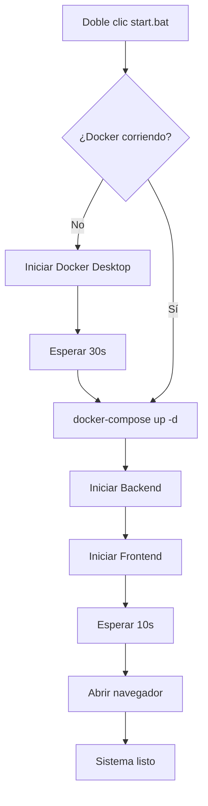

# 🚀 Scripts de Inicio Automático - Windows

## 📋 **Archivos Creados**

Este proyecto incluye varios scripts para facilitar el inicio en Windows:

### **1. `start.bat` (Recomendado para Windows)**
Script simple que inicia todo automáticamente.

**Ventajas:**
- ✅ Fácil de usar (doble clic)
- ✅ Abre ventanas separadas para cada proceso
- ✅ Colores en consola
- ✅ Abre navegador automáticamente

**Cómo usar:**
```
1. Doble clic en start.bat
2. Esperar a que todo inicie
3. El navegador se abrirá solo en http://localhost:5173
```

---

### **2. `start.ps1` (PowerShell avanzado)**
Script de PowerShell con más características.

**Ventajas:**
- ✅ Verificación robusta de Docker
- ✅ Mensajes de error detallados
- ✅ Logs en tiempo real
- ✅ Colores y emojis

**Cómo usar:**
```powershell
# Clic derecho → "Ejecutar con PowerShell"
# O desde PowerShell:
.\start.ps1
```

**Si da error de permisos:**
```powershell
# Ejecutar PowerShell como Administrador:
Set-ExecutionPolicy RemoteSigned -Scope CurrentUser
```

---

### **3. `stop.bat`**
Detiene los contenedores Docker.

**Cómo usar:**
```
1. Doble clic en stop.bat
2. Cierra manualmente las ventanas de terminal
```

---

### **4. Scripts NPM (Multiplataforma)**

Instalado en el `package.json` raíz.

**Instalar dependencias primero:**
```bash
npm install
```

**Comandos disponibles:**

| Comando | Descripción |
|---------|-------------|
| `npm run dev` | Inicia todo (Docker + Backend + Frontend) |
| `npm run server` | Solo backend |
| `npm run client` | Solo frontend |
| `npm run stop` | Detiene Docker |
| `npm run install:all` | Instala todas las dependencias |

**Ejemplo:**
```bash
npm run dev
# Esto ejecuta:
# 1. docker-compose up -d (MongoDB)
# 2. Backend en puerto 5000
# 3. Frontend en puerto 5173
# 4. Abre navegador automáticamente
```

---

## 🎯 **¿Cuál usar?**

### **Primera vez (Setup inicial):**
```bash
# Instalar dependencias
npm run install:all
```

### **Uso diario:**

**Opción 1 - BAT (Más simple):**
```
Doble clic en start.bat
```

**Opción 2 - NPM (Multiplataforma):**
```bash
npm run dev
```

**Opción 3 - PowerShell (Más control):**
```powershell
.\start.ps1
```

---

## 📦 **Dependencias del Script NPM**

El `package.json` raíz instala estas herramientas:

- **`concurrently`**: Ejecuta múltiples comandos en paralelo
- **`wait-on`**: Espera a que un servidor esté listo
- **`open-cli`**: Abre el navegador automáticamente

**Se instalan automáticamente al hacer:**
```bash
npm install
```

---

## ⚙️ **Configuración Avanzada**

### **Cambiar puerto del frontend:**

Edita `client/vite.config.js`:
```javascript
export default defineConfig({
  server: {
    port: 3000  // Cambiar aquí
  }
})
```

Actualiza el script:
- `start.bat`: Cambiar `5173` → `3000`
- `start.ps1`: Cambiar `5173` → `3000`
- `package.json`: Cambiar URL en script `open`

### **Cambiar puerto del backend:**

Edita `.env`:
```properties
SERVER_PORT=4000
```

---

## 🐛 **Solución de Problemas**

### **"Docker no está corriendo"**
1. Abre Docker Desktop manualmente
2. Espera a que diga "Docker is running"
3. Vuelve a ejecutar el script

### **"Puerto ya en uso"**
```bash
# Ver qué está usando el puerto
netstat -ano | findstr :5173
netstat -ano | findstr :5000

# Matar proceso
taskkill /PID <PID> /F
```

### **"No se puede ejecutar start.ps1"**
```powershell
# Ejecutar PowerShell como Administrador
Set-ExecutionPolicy RemoteSigned -Scope CurrentUser
```

### **"npm: comando no encontrado"**
- Node.js no está en el PATH
- Reinstalar Node.js marcando "Add to PATH"

---

## 🎬 **Flujo Completo**



---

## ✅ **Checklist Primera Vez**

- [ ] Node.js instalado
- [ ] Docker Desktop instalado y corriendo
- [ ] Repositorio clonado
- [ ] Archivo `.env` creado
- [ ] `npm install` ejecutado en raíz
- [ ] `npm install` ejecutado en `/server`
- [ ] `npm install` ejecutado en `/client`
- [ ] Doble clic en `start.bat`
- [ ] Navegador abre en http://localhost:5173

---

## 📞 **Comandos Útiles**

```bash
# Ver contenedores
docker ps

# Ver logs de MongoDB
docker-compose logs -f

# Reiniciar todo
npm run stop
npm run dev

# Limpiar node_modules
npm run clean
npm run install:all
```

---

¡Listo para desplegar! 🚀
